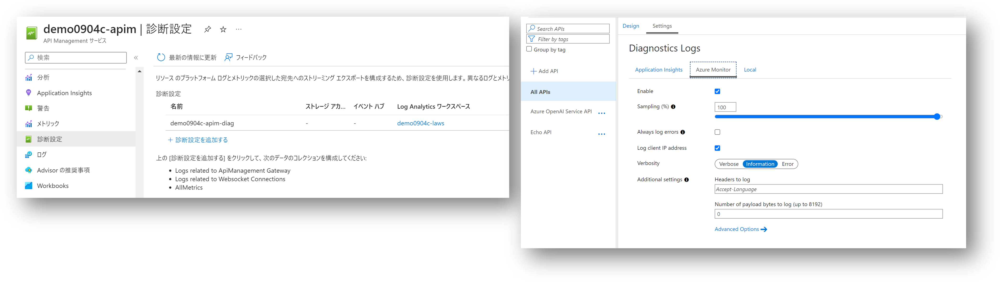

# Call OpenAI Service via API Management

Azure OpenAI を API Management で保護する構成を、IaC で一括デプロイするためのサンプルです。

## はじめに

[こちらのリファレンスアーキテクチャ](https://learn.microsoft.com/ja-jp/azure/architecture/ai-ml/openai/architecture/log-monitor-azure-openai)に記述されている通り、
以下の理由から API Management を介して Azure OpenAI Service を利用することがあります。

- Azure OpenAI Service 単体では出力できるログに制限がある
- OpenAI サービス用の API キーをすべてのクライアントアプリケーションで共有する

構成する方法は[こちら](https://learn.microsoft.com/en-us/semantic-kernel/deploy/use-ai-apis-with-api-management)に記載があるのですが、何度も手作業で構築するのが面倒なので自動化に挑戦してみました。

## 概要


- Azure OpenAI Service
- Azure API Management
    - Azure OpenAI Service をバックエンドとする API 定義
- Azure Application Insights
    - API Management 上で実行される各種 API のログ出力先
- Azure Log Analytics
    - Azure OpenAI および API Management のリソースログ（診断ログ）の出力先
    - Application Insights のワークスペースとしても利用

## サンプルコードの取得

このリポジトリを [Fork](https://github.com/ayuina/apim-aoai-sample/fork) して、ローカルに Clone してください。

```bash
git clone https://github.com/${your-gitaccount-name}/apim-aoai-sample.git
```

Visual Studio Code ないしは PowerShell ターミナルでクローンしたディレクトリを開きます。


## Open AI の仕様書をダウンロードする

API Management にインポートするための OpenAPI 仕様をダウンロードするスクリプトは以下のようになります。
本リポジトリにも[ダウンロード済みのもの](./infra/modules/apim-openai-interface.json)が含めてありますので、API 仕様のバージョンを確認して変更不要であればこの手順は飛ばしても構いません。

バージョンを変更したい場合は下記のスクリプトを適宜修正して実行してください。
利用可能な API のバージョンについては [リファレンス](https://learn.microsoft.com/ja-jp/azure/ai-services/openai/reference)を参照してください。

```powershell
$version = '2023-07-01-preview'
$status = $version.EndsWith('-preview') ? 'preview' : 'stable'
$output = './infra/modules/openai-interface.json'

Write-Host "Download OpenAI specification version: $version"
$specUrl = "https://raw.githubusercontent.com/Azure/azure-rest-api-specs/main/specification/cognitiveservices/data-plane/AzureOpenAI/inference/${status}/${version}/inference.json"
$temp = (Invoke-WebRequest -Uri $specUrl).Content | ConvertFrom-Json

Write-Verbose "overwrite endpoint to import api management. this value doesn't exists, but will be overwritten when bicep deployment"
$defaultEndpoint = $temp.servers.variables.endpoint.default
$tempAoaiUrl = "https://${defaultEndpoint}/openai"
$temp.servers | Add-Member -NotePropertyName "url" -NotePropertyValue $tempAoaiUrl -Force
$temp | ConvertTo-Json -Depth 100 | Out-File -FilePath $output -Force
```

## テンプレートのデプロイ

各種 Azure リソース、および先ほどダウンロードしておいた OpenAI 互換の API を API Management にインポートします。

```powershell
az login

$subscription = '<your subscription id>'
az account set -s $subscription

$region = 'japaneast'
$prefix = 'demo0904'
$rg = "${prefix}-rg"

az group create -n $rg -l $region
az deployment group create -f ./infra/main.bicep -g $rg -p prefix=$prefix region=$region aoaiRegion=$region
```

## テスト実行

API Management にデプロイされた OpenAI 互換の API を呼び出してみます。
ここでは [REST Client](https://marketplace.visualstudio.com/items?itemName=humao.rest-client)
を使用していますが、Curl や Postman など任意のツールをご利用ください。

```rest
@model=g35t
@version=2023-07-01-preview

POST https://{{$dotenv APIM_NAME}}.azure-api.net/openai/deployments/{{model}}/chat/completions?api-version={{version}} HTTP/1.1
api-key: {{$dotenv APIM_KEY}}

{
  "messages": [
    {"role":"system","content":"You are an AI assistant that helps people find information."},
    {"role":"user","content":"Who are you ?"}
  ],
  "max_tokens": 800,
  "temperature": 0.7,
  "frequency_penalty": 0,
  "presence_penalty": 0,
  "top_p": 0.95,
  "stop": null
}
```

HTTP 200 OK が返ってくれば成功です。

## ログの確認

それでは API Management から Azure Monitor に出力されるログを確認していきましょう。

### Application Insights

まず本命の Application Insights です。
API Management の設定で Application Insights のロガーが登録されており、
インポート済みの OpenAI サービス互換の API 定義の設定からそれを参照する形になっているはずです。
出力設定を変更したい場合はこちらの画面で修正するか、[テンプレート](./infra/modules/apim-openai-apidef.json)を修正して再デプロイしてください。


この状態で API Management 経由で Azure OpenAI サービスを呼び出すと、ログが取れるだけでなく各種の分析機能も利用可能です。

|Application Insights|画面イメージ|
|---|---|
|Kusto ログ||
|アプリケーション マップ||
|ライブメトリック||
|E2E トランザクション||
|失敗||


### Log Analytics Workspace

次に Log Analytics Workspace です。
診断ログの設定でログの転送先として Log Analytics Workspace が登録されており、
API の設定で Log Analytics への記録が有効になっているはずです。
なおここでは設定していませんが、Appliation Insights と同様に リクエスト/レスポンスのヘッダーやボディをログに含めることも可能です。



ログの出力先として Log Analytics Workspace を指定しているので、Kusto クエリで検索することが可能です。
Application Insightsとは異なり各種の分析機能がありませんので、かなりの Kusto 力が要求されることになります。


### Azure OpenAI から Log Analytics Workspace へ転送されたログ

そもそもの発端となるこちらの Azure OpenAI Service から直接出力されるログも確認しておきましょう。
API Management と同様に診断ログの設定として Log Analytics Workspace が登録されているのですが、出力項目をより詳細化するようなオプションがありません。
このため下記のような固定的なデータが得られるのみでボディ部が含まれておらず、プロンプトの履歴を分析したりといったような用途に使えないということになります。


## まとめ

ログを取るためだけに API Management を挟むのは若干釈然としない気持ちもないわけではありません。
ただ API Management を挟みこむことで Azure OpenAI を直接クライアントアプリケーションに露出せず、 VNET による閉域化や Managed ID 認証によるアクセス制御をかけることが可能になります。
また API Management が提供する各種ポリシー機能を併せて活用したり、OpenAI 以外の API も含めて管理させてやることで価値が大きくなってくるのではないでしょうか。

## 参考情報

- [Implement logging and monitoring for Azure OpenAI models](https://learn.microsoft.com/ja-jp/azure/architecture/ai-ml/openai/architecture/log-monitor-azure-openai)
- [Protect your Azure OpenAI API keys with Azure API Management](https://learn.microsoft.com/en-us/semantic-kernel/deploy/use-ai-apis-with-api-management)
- [Azure OpenAI Service REST API reference](https://learn.microsoft.com/en-us/azure/ai-services/openai/reference)
- [Sample APIs for Azure API Management](https://github.com/Azure-Samples/api-management-sample-apis)
- [BICEP-Automate deployment of API Management and its components](https://vinniejames.medium.com/bicep-automate-deployment-of-api-management-and-its-components-26e4b8aee28)
