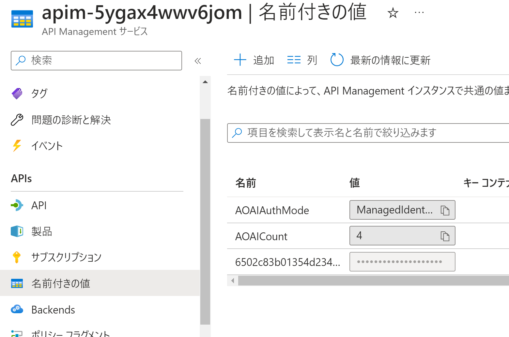
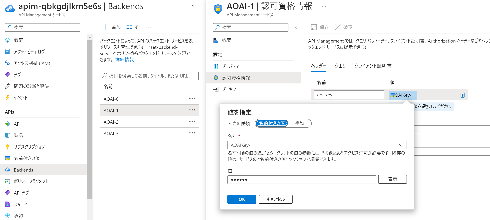

# Call OpenAI Service via API Management

Azure OpenAI を API Management で保護する構成を、IaC で一括デプロイするためのサンプルです。

## はじめに

[こちらのリファレンスアーキテクチャ](https://learn.microsoft.com/ja-jp/azure/architecture/ai-ml/openai/architecture/log-monitor-azure-openai)に記述されている通り、
以下の理由から API Management を介して Azure OpenAI Service を利用することがあります。

- Azure OpenAI Service 単体では出力できるログに制限がある
- OpenAI サービス用の API キーをすべてのクライアントアプリケーションで共有する

これを構成する方法は[こちら](https://learn.microsoft.com/en-us/semantic-kernel/deploy/use-ai-apis-with-api-management)に記載があるのですが、何度も手作業で構築するのが面倒なので自動化に挑戦してみました。
ただこのままでは面白みがないので以下のカスタマイズをしています。

- API Management へのアクセスも Azure OpenAI と同様に `api-key` HTTP ヘッダーで認証することで互換性を維持しています
- 特定の api-version を API Management に登録するようにしています（複数指定可能）
- API Magagement にインポートした OpenAI API のログを Application Insights で取得するように構成しています
- Azure OpenAI Service のログを Log Analytics に収集するように構成しています
- 複数の Azure OpenAI Service にリクエストを振り分けることで簡易的な負荷分散をしています
- API Management の Managed ID を使用して Azure OpenAI Service にアクセスすることでキー登録を不要にしています

### 留意事項

本サンプルの作成時には GPT-3.5 モデルに対する Chat Completion API の呼び出しのみを確認しています。
その他のモデル（GPT-4, DALL-E, Embedding など）や その他の API （Completions, Embedding など）については動作確認していませんので、ご注意ください。

## 概要


- Azure OpenAI Service
- Azure API Management
    - Azure OpenAI Service をバックエンドとする API 定義
- Azure Application Insights
    - API Management 上で実行される各種 API のログ出力先
- Azure Log Analytics
    - Azure OpenAI および API Management のリソースログ（診断ログ）の出力先
    - Application Insights のワークスペースとしても利用

## サンプルコードの取得

このリポジトリを [Fork](https://github.com/ayuina/apim-aoai-sample/fork) して、ローカルに Clone してください。

```bash
git clone https://github.com/${your-gitaccount-name}/apim-aoai-sample.git
```

Visual Studio Code ないしは PowerShell ターミナルでクローンしたディレクトリを開きます。


## 最新の Open AI の仕様書をダウンロードする

API Management にインポートするための OpenAPI 仕様をダウンロードするスクリプトは以下のようになります。
本リポジトリにも[ダウンロード済みのもの](./infra/oepnaispec)が含めてありますので、API 仕様のバージョンを確認して変更不要であればこの手順は飛ばしても構いません。

```powershell
./scripts/download-openaispec.ps1
```

## テンプレートのデプロイ

各種 Azure リソースをデプロイし、先ほどダウンロードしておいた OpenAI 互換の API の定義も API Management にインポートします。

```powershell
az login

$subscription = '<your subscription id>'
az account set -s $subscription

$region = 'japaneast'
$rgName = 'demo0908-rg'

az group create -l $region -n $rgName
az deployment group create -g $rgName -f ./infra/main.bicep 

# (Option) インポートする api-version を指定したい場合は以下のように実行します
az deployment group create -g $rgName -f ./infra/main.bicep -p targetVersions="['2023-05-15', '2023-06-01-preview']"

# (Option) Azure OpenAI Service をデプロイするリージョンを指定する場合には以下のように実行します。
az deployment group create -g $rgName -f ./infra/main.bicep -p aoaiRegions="['japaneast', 'eastus2', 'switzerlandnorth']"

# (Option) 既定では API Management > OpenAI のアクセスは Managed ID で認可を行っていますが、API キー認証でデプロイすることも可能です。
az deployment group create -g $rgName -f ./infra/main.bicep -p enableManagedIdAuth=false

```

### 複数バージョンの API 定義を確認

完了後に Azure Portal で API Management を開くと OpenAI の複数の `api-version` が登録されています。
ここで登録していない `api-version` をクライアントが呼び出そうとすると、API が存在しないというエラーになりますのでご注意下さい。


## API Management 経由で Azure OpenAI を呼び出す

API Management にデプロイした OpenAI 互換の API を呼び出してみます。
ここでは [REST Client](https://marketplace.visualstudio.com/items?itemName=humao.rest-client)
を使用しています。
API Management の名前や API キーは `.env` に切り出していますので、ファイルを作成の上で各値を Azure Portal 等から取得してください。
もちろん Curl や Postman など任意のツールで実施いただいても構いません。

```rest
@model=g35t
@version=2023-06-01-preview

POST https://{{$dotenv APIM_NAME}}.azure-api.net/openai/deployments/{{model}}/chat/completions?api-version={{version}} HTTP/1.1
api-key: {{$dotenv APIM_KEY}}

{
  "messages": [
    {"role":"system","content":"You are an AI assistant that helps people find information."},
    {"role":"user","content":"Who are you ?"}
  ],
  "max_tokens": 800,
  "temperature": 0.7,
  "frequency_penalty": 0,
  "presence_penalty": 0,
  "top_p": 0.95,
  "stop": null
}
```

HTTP 200 OK が返ってくれば成功です。

## API Management や OpenAI 呼び出しのログ

それでは API Management から Azure Monitor に出力されるログを確認していきましょう。

### Application Insights

まず本命の Application Insights です。
API Management の設定で Application Insights のロガーが登録されており、
インポート済みの OpenAI サービス互換の API 定義の設定からそれを参照する形になっているはずです。
出力設定を変更したい場合はこちらの画面で修正するか、[テンプレート](./infra/modules/apim-openai-apidef.json)を修正して再デプロイしてください。


この状態で API Management 経由で Azure OpenAI サービスを呼び出すと、ログが取れるだけでなく各種の分析機能も利用可能です。

|Application Insights|画面イメージ|
|---|---|
|Kusto ログ||
|アプリケーション マップ||
|ライブメトリック||
|E2E トランザクション||
|失敗||

### Log Analytics Workspace

次に Log Analytics Workspace です。
診断ログの設定でログの転送先として Log Analytics Workspace が登録されており、
API の設定で Log Analytics への記録が有効になっているはずです。
なおここでは設定していませんが、Appliation Insights と同様に リクエスト/レスポンスのヘッダーやボディをログに含めることも可能です。


ログの出力先として Log Analytics Workspace を指定しているので、Kusto クエリで検索することが可能です。
Application Insightsとは異なり既定の可視化や分析機能がありませんので、かなりの Kusto 力が要求されることになります。


### Azure OpenAI から Log Analytics Workspace へ転送されたログ

そもそもの発端となるこちらの Azure OpenAI Service から直接出力されるログも確認しておきましょう。
API Management と同様に診断ログの設定として Log Analytics Workspace が登録されているのですが、出力項目をより詳細化するようなオプションがありません。
このため下記のような固定的なデータが得られるのみでボディ部が含まれておらず、プロンプトの履歴を分析したりといったような用途に使えないということになります。


## 複数の OpenAI サービスへの負荷分散

デプロイ時に Azure OpenAI サービスのデプロイリージョンを複数指定した場合、API Management が受け付けたリクエストの転送先が各 Azure OpenAI サービスに分散されます。
これは API の ポリシーを使用して、以下のようにバックエンドを切り替えることで実現しています。

```xml
<set-backend-service backend-id="@( string.Format( "AOAI-{0}", DateTime.Now.Ticks % int.Parse("{{AOAICount}}") ) )" />
```

ポリシーから参照している Azure OpenAI サービスの数（`AOAICount`）が API Management の `名前付きの値`に、各 Azure OpenAI サービスのエンドポイント（AOAI-_n_）がAPI Management の `バックエンド` に登録されています。

|機能|参考|
|---|---|
|名前付きの値||
|バックエンド||

下記は４リージョンに Azure OpenAI サービスを配置し、API Management に 1000 回リクエストを送信した結果のアプリケーションマップです。
おおむね均等に分散できていることが確認できます。


### Azure OpenAI Service のリージョンの選択

現状 Azure OpenAI Service はリージョンによってデプロイできるモデルやバージョンにばらつきがあり、また各バージョンごとに利用可能な API が異なります。
これらの組み合わせは頻繁に更新されていますので、[ドキュメントを参照して](https://learn.microsoft.com/en-us/azure/ai-services/openai/concepts/models)相互に互換性のあるリージョンを選択するようにご注意ください。

## Azure OpenAI Service アクセス時の認証方式

クライアントから API Management へのアクセスには API Management から発行されたサブスクリプションの API キーを利用していますば、
API Management から Azure OpenAI Service へのアクセスには二つの認証方式に対応しています。

### Mangaged Identity を利用する

既定では [API Management の System Assigned Managed Identity](https://learn.microsoft.com/ja-jp/azure/api-management/api-management-howto-use-managed-service-identity) を利用して認証します。
Azure OpenAI Service にアクセスするためのトークンは API の [authentication-managed-identity ポリシー](https://learn.microsoft.com/ja-jp/azure/api-management/authentication-managed-identity-policy)を利用することで、
バックエンド呼び出し時の Authorization Header に設定しています。

```xml
<choose>
    <when condition="@("{{AOAIAuthMode}}" == "ManagedIdentity")">
        <authentication-managed-identity resource="https://cognitiveservices.azure.com/" />
    </when>
</choose>
```

Azure OpenAI Service の `アクセス制御` を確認すると、API Management の Managed Identity が [Cognitive Service OpenAI Contributor ロールに割り当てられている](https://learn.microsoft.com/en-us/azure/ai-services/openai/how-to/role-based-access-control)
ことが確認できます。


### API キーを利用する

デプロイ時に Managed Identity を無効（`-p enableManagedIdAuth=false`） にした場合には、上記の `choose/when/@condition` が `false` になる用に `AOAIAuthMode` の値を設定しています。
この場合 API Management から Azure OpenAI Service へのアクセスには API キーを利用する必要がありますが、
これらの値は API Management の `名前付きの値` および `バックエンド` の `認証資格情報` として設定されています。

|機能|参考|
|---|---|
|名前付きの値||
|バックエンド||

また API Management の Managed Identity は無効になっており、RBAC によるアクセス許可も設定されていません。

## まとめ

ログを取るためだけに API Management を挟むのは若干釈然としない気持ちもないわけではありません。
ただ API Management を挟みこむことで Azure OpenAI を直接クライアントアプリケーションに露出せず、 VNET による閉域化や Managed ID 認証によるアクセス制御をかけることが可能になります。
また API Management が提供する各種ポリシー機能を併せて活用したり、OpenAI 以外の API も含めて管理させてやることで価値が大きくなってくるのではないでしょうか。

## 参考情報

- [Implement logging and monitoring for Azure OpenAI models](https://learn.microsoft.com/ja-jp/azure/architecture/ai-ml/openai/architecture/log-monitor-azure-openai)
- [Protect your Azure OpenAI API keys with Azure API Management](https://learn.microsoft.com/en-us/semantic-kernel/deploy/use-ai-apis-with-api-management)
- [Azure OpenAI Service REST API reference](https://learn.microsoft.com/en-us/azure/ai-services/openai/reference)
- [Sample APIs for Azure API Management](https://github.com/Azure-Samples/api-management-sample-apis)
- [BICEP-Automate deployment of API Management and its components](https://vinniejames.medium.com/bicep-automate-deployment-of-api-management-and-its-components-26e4b8aee28)
